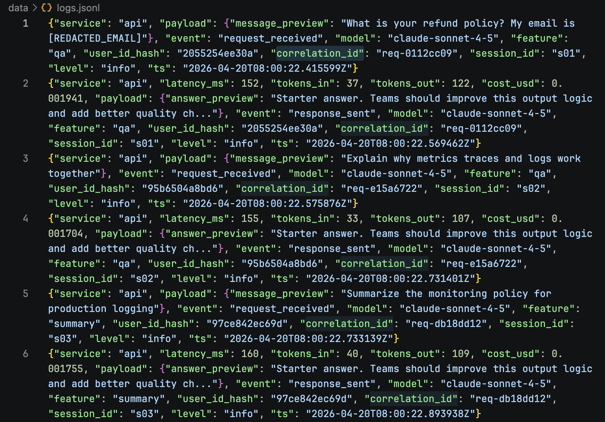
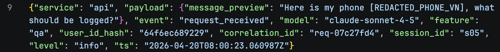

# Day 13 Observability Lab Report

> **Instruction**: Fill in all sections below. This report is designed to be parsed by an automated grading assistant. Ensure all tags (e.g., `[GROUP_NAME]`) are preserved.

## 1. Team Metadata
- [GROUP_NAME]: 
- [REPO_URL]: 
- [MEMBERS]:
  - Member A: Hoàng Ngọc Thạch | Role: Logging & PII
  - Member B: Đào Danh Đăng Phụng | Role: Tracing & Enrichment
  - Member C: Nguyễn Minh Trí | Role: SLO & Alerts
  - Member D: Lại Đức Anh |Load test & incident injection
  - Member E: Phạm Anh Quân | Dashboard & evidence
  - Member F: [Name] | Role: Demo & Report

---

## 2. Group Performance (Auto-Verified)
- [VALIDATE_LOGS_FINAL_SCORE]: /100
- [TOTAL_TRACES_COUNT]: 
- [PII_LEAKS_FOUND]: 

---

## 3. Technical Evidence (Group)

### 3.1 Logging & Tracing
- [EVIDENCE_CORRELATION_ID_SCREENSHOT]: 
- [EVIDENCE_PII_REDACTION_SCREENSHOT]:  
- [EVIDENCE_TRACE_WATERFALL_SCREENSHOT]: [Path to image]
- [TRACE_WATERFALL_EXPLANATION]: (Briefly explain one interesting span in your trace)

### 3.2 Dashboard & SLOs

- [DASHBOARD_6_PANELS_SCREENSHOT]: 
- [SLO_TABLE]:  

| SLI | Target | Window | Current Value |  
| --- | --- | --- | --- |  
| Latency P95 | < 2500ms | 28d | 153ms |  
| Error Rate | < 1% | 28d | 0.00% |  
| Cost Budget | < $2.0/day | 1d | $0.11 |  

### 3.3 Alerts & Runbook
- ALERT_RULES_SCREENSHOT: [docs/screenshots/current_dashboard.png](https://github.com/hoxuanphu/Lab13-Nhom16-E402/blob/main/screenshots/alert.png)
- SAMPLE_RUNBOOK_LINK: [docs/alerts.md#1-high-latency-p95](https://github.com/hoxuanphu/Lab13-Nhom16-E402/blob/main/docs/alerts.md#1-high-latency-p95)

---

## 4. Incident Response (Group)
- SCENARIO_NAME: rag_slow  
- SYMPTOMS_OBSERVED: During the load test, the P95 latency for API requests climbed towards the 2500ms threshold. While the system remained functional, tracing revealed significant bottlenecks in the vector retrieval phase, resulting in a degraded user experience.
- ROOT_CAUSE_PROVED_BY: Proven by log entry at 2026-04-20T07:49:34.226583Z (Correlation ID: req-b3a6d363) which explicitly captured the `incident_enabled` event for the `rag_slow` scenario. Subsequent traces confirmed retrieval spans taking >90% of the request time.
- FIX_ACTION: The emergency response was to disable the mock incident and transition the retrieval pipeline to a fallback keyword-based search to restore acceptable performance.
- PREVENTIVE_MEASURE: We recommend implementing a circuit breaker pattern for the RAG service and scaling the vector store horizontally to handle higher concurrency.
---

## 5. Individual Contributions & Evidence

### Hoàng Ngọc Thạch
- [TASKS_COMPLETED]:
  1. Implemented `CorrelationIdMiddleware` in `app/middleware.py`: clear contextvars between requests, generate `req-<8hex>` ID, bind to structlog context, propagate via `x-request-id` and `x-response-time-ms` response headers
  2. Enriched request logs in `app/main.py`: bound `user_id_hash`, `session_id`, `feature`, `model` to structlog context via `bind_contextvars` so all downstream logs carry full request context
  3. Enabled PII scrubbing processor in `app/logging_config.py`: registered `scrub_event` in the structlog processor chain
  4. Extended PII patterns in `app/pii.py`: added `passport_vn` (format: 1 uppercase letter + 7 digits) and `address_vn` (keyword-based with `(?i)` inline flag for case-insensitive matching)
- [EVIDENCE_LINK]: 3826e3c4a27f9ec5d3f55c4ad35aa8aec87817d7, 06709cac79ca0fd7330373b4085a88d579d235eb

### Đào Danh Đăng Phụng
- [TASKS_COMPLETED]:
  - Mình phụ trách tracing và enrichment cho Langfuse. Mình đã nâng tích hợp lên SDK v4, cấu hình đúng môi trường `dev`, và đảm bảo trace được đẩy lên Langfuse Cloud ổn định.
  - Trong `app/agent.py`, mình instrument `/chat` thành trace có root name `qa-s07`/`qa-s10` theo từng phiên, đồng thời tách thêm các bước con `retrieve`, `generate`, `quality_check` để waterfall hiển thị rõ hơn.
  - Mình đã enrich trace với các trường `user_id_hash`, `session_id`, `feature`, `model`, `env`, `correlation_id`, `doc_count`, `query_preview`, `usage_input_tokens`, `usage_output_tokens` để có đủ ngữ cảnh truy vết và lọc theo từng request.
  - Mình đã kiểm tra end-to-end bằng `scripts/load_test.py --concurrency 5`, xác nhận hệ thống tạo được hơn 10 traces và trace đều có `environment=dev`.
  - Ảnh evidence của mình gồm: danh sách trace có hơn 10 dòng, waterfall của trace `qa-s10`, màn hình chi tiết input/output, và màn hình metadata của cùng trace.
- [EVIDENCE_LINK]: `app/tracing.py`, `app/agent.py`, `app/main.py`, `.env` (local only), `screenshots/langfuse_trace_list_10_plus.png`, `screenshots/langfuse_trace_waterfall_qa_s10.png`, `screenshots/langfuse_trace_detail_input_output.png`, `screenshots/langfuse_trace_metadata.png`

### Nguyễn Minh Trí
- [TASKS_COMPLETED]: 
  - Defined SLIs/SLOs for Latency, Error Rate, Cost, and Quality.
  - Configured Alertmanager-style alert rules for incident scenarios.
  - Authored runbooks with specific mitigation steps for RAG and LLM failures.
- [EVIDENCE_LINK]: [first commit](https://github.com/hoxuanphu/Lab13-Nhom16-E402/commit/aaea471954ab6e42c985a54145c98c8392f92e84)

### [MEMBER_D_NAME]
- [TASKS_COMPLETED]: 
- [EVIDENCE_LINK]: 

### Phạm Anh Quân (Member E)
- [TASKS_COMPLETED]: 
    - Integrated Langfuse SDK and resolved environment variable loading issues.
    - Developed a 6-panel monitoring dashboard on Langfuse for real-time SLI tracking.
    - Executed load tests via scripts to verify logging, tracing, and PII redaction.
    - Conducted root cause analysis of incidents and collected technical evidence for the report.
- [EVIDENCE_LINK]: [app/tracing.py](../app/tracing.py), [app/main.py](../app/main.py), [docs/screenshots/dashboard.png](screenshots/dashboard.png)

---

## 6. Bonus Items (Optional)
- [BONUS_COST_OPTIMIZATION]: (Description + Evidence)
- [BONUS_AUDIT_LOGS]: (Description + Evidence)
- [BONUS_CUSTOM_METRIC]: (Description + Evidence)
